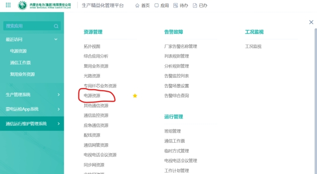
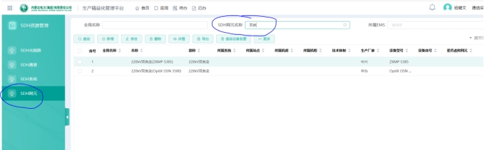

# TMS操作说明

## 录入设备流程说明

### 一、电源资源录入流程

（一）进入电源资源页面

在TMIS系统中新增通信电源台账，需首先进入资源管理->电源资源页面。

 

（二）录入“电源系统”

进入电源资源页面后，首先点击“电源系统”选项卡，然后点击“新增”按钮，并按如下格式录入相关信息，并确认。

注意：名称字段的格式为“xxxkVxx变电源系统”。

 

（三）录入高频开关电源

点击“通信电源”选项卡，然后点击“新增”按钮，并按如下格式录入相关信息，并确认。

注意：1.名称字段的格式为“xxxkVxx变通信高频开关电源x”

2.设备类型为“整流电源”

3.所属电源系统为上一步中录入的电源系统，设备序号为台账中当前高频开关电源的序号，例如当前设备为通信高频开关电源屏1，则设备序号为1。

4.市电输入1、2信息应填写交流进线信息，若交流进线取自交流分配屏，应填写交流分配屏及其空开序号，若取自站用变，则应填写站用变分配屏相关信息。

5.市电输入1、2容量应填写相应上级交流分配单元的空开容量。

 

（四）录入直流分配屏

同样在“通信电源”选项卡，点击“新增”，录入直流分配屏台账信息。

注意：1.名称字段的格式为“xxxkVxx变直流分配屏”，具体名称以设备台账为准，但变电站名称必须包含。

2.设备类型为“直流配电屏”

3.市电输入1、2信息统一录入当前直流分配屏I段II段取自哪一路高频开关电源。

 

（五）录入交流分配屏

录入交流分配屏的步骤和上述第四步基本一致，但设备类型为“交流配电屏”，市电输入1、2信息为实际的交流数据信息。

（六）录入蓄电池组

点击“蓄电池组”选项卡，然后点击“新增”按钮，并按如下格式录入相关信息，并确认。

注意：1.所属系统为以上第二步中新建的电源系统。

2.技术体制为阀控式铅酸蓄电池组。

 

 

### 二、空间资源核对流程

（一）站点管理信息核对

1、点击“资源管理->空间资源->站点管理”，进入站点管理页面，在“站点名称”处输入变电站名称，然后点击查询。

 

2、若存在该站点，请选中该条目，点击修改，并核对信息是否正确，修改完成后点击确定。

3、若不存在该站点，点击“新增”，并按下图创建该站点。

注意：（1）站点名称必须包含电压等级；

（2）ABCD级不清楚的，询问方式班。

 

（二）机房管理信息核对

1、在“站点名称”处输入变电站名称，并点击查询。

 

2、若存在相关站点的机房信息，依次***\*双击\****相关条目，核对信息是否正确。

3、若不存在相关机房信息（即该站点为新增站点），点击新增，并按下图创建机房。

注意：（1）“名称”字段的格式为：H0X-x楼xxx室

（2）“机房编码”字段的格式为：H0X

 

（三）机架信息核对

1、在“机房名称”处输入变电站名称，点击查询。

 

2、若存在相关机架信息，首先结合设备台账，核对所有机架是否均收录在该页面，如果缺少，点击“新增”按钮，增加条目；如果信息有误（如屏位号错误），点击“修改”按钮，修改相关信息。

3、若该站点为新增站点，则需手动增加机架信息，点击“新增”按钮，并填写相应信息，如下图所示。

注意：（1）“名称”字段的格式为：Rxxx-XXX设备屏x；

（2）“空间编码”字段的格式为：Rxxx

 

### 三、交换网设备录入流程

1、进入TMIS，点击“资源管理”中的“交换网资源”。

 

2、点击“交换网设备”，再点击新增。

 

3、按下图格式填写调度总机台账信息。

注意：（1）所属系统根据设备厂家进行区分，如下图所示。

（2）设备类型统一为：调度交换机

（3）设备子类型统一为：二层交换机

 

 

4、全部填写完成后，点击“确定”。

### 四、通信综合数据网设备核对流程

1、进入TMIS，点击“资源管理”中的“数据网资源”。

 

2、点击“数据网设备”选项卡，并在全局名称处输入变电站名称进行查找。

 

3、双击台账条目，核对台账信息。

 

4、如果台账信息有误，首先选中该条目，然后点击“修改”按钮进行编辑，最后保存信息即可。

 

5、如果没有该变电站的通信综合数据网台账信息，但实际该站点具有通信综合数据网设备，则应新建该设备台账信息，具体操作为：点击“新增”按钮，根据实际情况填写台账信息，最后进行保存即可。

五、PCM设备核对流程

1、进入TMIS，点击“资源管理”中的“PCM资源”，并点击进入“PCM设备”选项卡。

2、PCM设备后续核对流程与通信综合数据网设备核对流程一致，具体请参考第五小节中的操作流程。

六、SDH设备核对流程

***\*注意：仅需核对华为、中兴、烽火品牌的SDH设备，无需核对西门子SDH设备！\****

1、进入TMIS，点击“资源管理”中的“SDH资源”，并点击进入“SDH网元”选项卡。

2、在全局名称处输入变电站名称，回车进行查询。

 

3、双击相关条目，可打开“详情SDH设备”页面，在该页面中核对台账信息。

注意：（1）仅需核对“基本信息”页面的内容。

（2）主要核对设备型号、设备序号、所属网络。

（3）其中***\*设备序号\****表示该设备为此变电站的第几台同品牌设备，例如：500kV包北变华为光端机屏2，该设备的设备序号即为“2”。

（4）其中***\*所属网络\****指：220kV及以下变电站，华为设备属于“地区A网”，中兴设备属于“地区B网”。

 

4、如以上信息有误，请点击“修改”按钮，进行更正，并保存信息。

5、对于未查找到的SDH设备，无需手动新增设备，因为TMIS系统会自动从网管同步相关设备。

 

### 五、配线资源核对流程

（一）数字配线架信息核对

1、进入TMIS系统，点击“配线资源”，进入相关页面。

 

2、首先进入“数字配线架”选项卡，在全局名称中输入变电站名称，然后点击“查询”按钮，即可查找处该变电站的全部数配资源。

 

3、若想查找该变电站的某一数配，第一步先点击“展开更多查询”，第二步在所属机柜中输入数字配线屏名称，例如数字配线屏1，第三步，点击查询按钮即可，如下图所示。

 

4、查找到的数配信息如下图，下图展示了220kV九原变数字配线屏2的台账信息，在这些信息中，每一个条目代表一排数字配线子框，一个子框通常有8或16对数配端子，***\*但从TMIS所显示的信息中，并不能直观的显示出该子框属于哪一台光传输设备，因此，为了方便后续设备上架操作以及台账信息的查找，现对所有TMIS数配台账信息做如下修改，具体参照下一步\****。

 

5、TMIS数配资源台账信息主要修改“简称”字段，以达到台账信息清晰明了的目的，具体效果如下图。我们将简称字段修改为该数配子框对应的光传输设备及其2M端口号，***\*例如九原变数配1的第5个DDF子框“DDF子框-A05”，与之相连的光传输设备是西门子2号机的第1~16个2M出线，因此，该子框的简称改为“西门子2# 1-16”\****，具体修改步骤见下一步。

 

6、修改DDF子框简称的步骤如下：

（1）首先，我们需要查找该变电站的设备台账，确定数字配线屏内所有DDF子框与光传输设备的连接关系。例如根据查找台账，我们知道九原变数配2的第一个子框属于中兴光端机的第1~16个2M出线。

 

（2）然后，单击选中该DDF子框条目“DDF子框-A01”，再点击修改。

 

（3）在弹出的修改数字配线架页面中，***\*将“简称”字段更改为：中兴# 1-16\****（#与数字之间留一个空格），其他设备以此类推，当有多台同品牌设备时，在#号前加数字区分，例如：西门子光端机2的第17-32个2M，则简称字段命名为：西门子2# 17-32。

 

（4）修改完成后，点击“确定”进行保存。

7、完成以上修改后，请大家核对数字配线架中的其他信息是否正确，如果有误则一并修改。

 

 

### 六、设备上架操作流程

1、进入TMIS系统，点击“资源管理”中的“空间资源”，进入如下页面，在该页面中，点击“机架”选项卡，并在全局名称处输入变电站名称，点击“查询”，即可出现当前变电站的所有设备屏。

 

2、勾选第一个设备屏，然后点击“修改”按钮。

 

3、在弹出的修改机架页面，点击“机架展开图”，并在此页面进行设备上架操作。

 

4、设备上架操作流程

（1）首先确定页面左侧是否存在相关设备，存在则需上架，如果不存在设备，则该屏位不需要进行上架操作。如下图，该PCM设备屏1存在两台设备，这两台设备均需上架。

 

（2）以萨基姆PCM设备为例，我们进行上架操作：首先需要根据设备相关照片，确定设备在屏位中的安装位置和占用空间，如下图所示，九原变萨基姆PCM设备安装在PCM设备屏1的9~14U处，共占用5U的宽度。

 

（3）返回TMIS系统，在需要上架的设备处点击鼠标***\*右键\****，然后点击弹出的“上架”按钮，

 

（4）在弹出的“上架”页面中，在“占U序号”中填入设备占用的起始U数，例如九原变萨基姆PCM的“占U序号”为9；在“跨U数”中填入设备占用的U数，例如九原变萨基姆PCM的“跨U数”为5；“正反面”根据实际情况填写，最后点击确定。

 

（5）修改机架页面右侧的机架展开图变为蓝色，即代表设备上架成功，同时，向右滑动下图中的滑块，也可看见当前设备已上架的标识。

 

（6）重复上述步骤，直至所有设备上架成功。

5、重复第2步到第4步，将所有屏位内的设备全部上架。

## 用户光端机上架说明

1、进入【空间资源】

 

2、查询站点，可以先在【查询】一下是否已经有这个站，如果没有，选择【新增】

 

3、新增站点，选择【新增】，输入站点名称，如中利腾辉光伏

 

 

4、查询机房是否已经存在，选择【机房管理】，在【全局名称】中查询是否有此机房，如果没有，点击【新增】

 

 

5、新增机房，在【站点】中选择刚才建好的站点，在【名称】中填写XXX通信机房

 

 

6、查询机架，查看该站是否已经有光端机屏，若没有，需新建R002-光端机屏

 

 

7、新增机架，名称统一为R002-光端机屏

 

 

**8、*****\*补全用户站光端机网元信息，包括华为和中兴网元\****

 

***\*在“SDH网元名称”处搜索用户站名称，点击查询后会出现用户站网元，切记，该出不能点击“新增”！！！\****

 

选中一个网元，点击修改。

 

***\*补全“基本信息”中的所有必填项，并点击确定。\****

 

9、光端机上架，在【空间资源】中的【机架】中找到相应站点的光端机屏，双击打开，选中光端机后右键，上架，填写占U序号，从上到下共42U，华为光端机占U序号填写，5，跨U数填写10，中兴光端机占U序号填写20，跨U数填写10

 

 

 

 

 