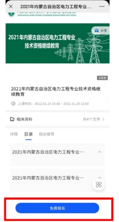
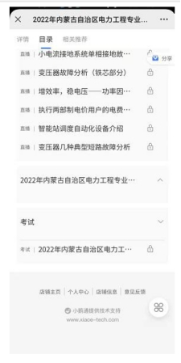
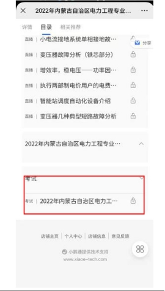
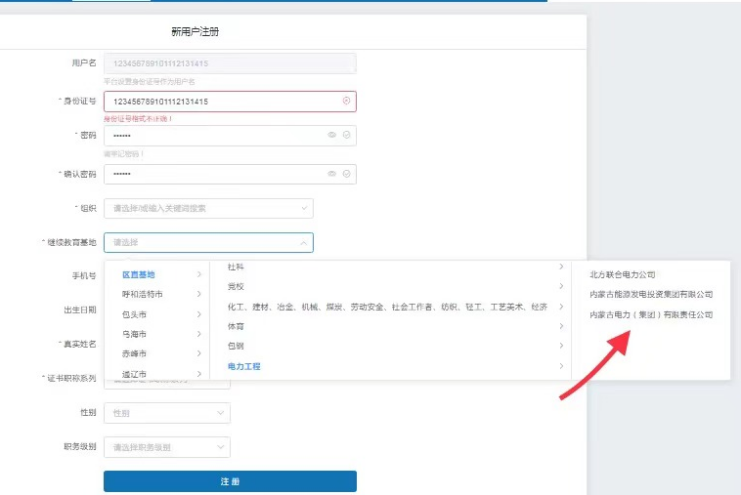
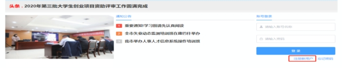

# 继续教育学习说明

## 内蒙古自治区电力工程专业技术资格继续教育平台学习考试登录说明

 

**一、*****\*登录方式\****

1.2023年内蒙古自治区电力工程专业技术资格继续教育

（1）网页登录

https://bdi.xet.tech/s/2303oB

（2）二维码登录

 

2.2022年内蒙古自治区电力工程专业技术资格继续教育

（1）网页登录

https://bdi.h5.xeknow.com/s/1ZO3rm

（2）二维码登录

 

3.2021年内蒙古自治区电力工程专业技术资格继续教育

（1）网页登录

https://bdi.h5.xeknow.com/s/3vPhP8

（2）二维码登录

 

***\*二、登录步骤\****

1.扫描二维码或登录网址

2.点击***\*免费报名\****

 

3. 如实填写***\*个人信息\****

4.课程学习

5.通过考试完成本年度继续教育

 

 

## 公需课登录学习说明

1．登录注册

**PC端（电脑）**：登录对应地区的培训计划网址https://zj.nmgrcpx.com/。在首页进行登录，往年参加过学习的学员，可尝试输入之前的账号密码登录。如登录不成功，则需点击**[新用户注册]**，登录进入[学习中心]，选择相应课程计划—激活—付费—选课—学习。

|      |                                    |
| ---- | ---------------------------------- |
|      |  |

 

 

**微信小程序**：微信搜索【云知识教育】，可在PC端首页扫码进入，或直接输入账号密码登录。

2.课程

公需课均为必修课，无需自行添加，购买课程后课直接学习。

3.考试

公需课为30个学时，**全部课程学习完成后，方可参加考试。**

**在学习中心，点击[我的考试]—[去考试]。**